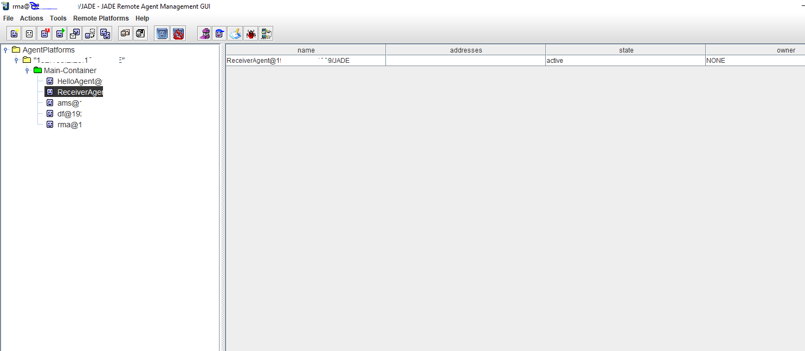

# AF4J

AF4J is Agentic Framework for Java. It demonstrates creation of AI agents using the Java Agent DEvelopment Framework (JADE) and [Tools4AI](https://github.com/vishalmysore/Tools4AI).

[JADE](https://jade-project.gitlab.io/page/guidesandtutorials/) (Java Agent DEvelopment Framework) is a software framework fully implemented in the Java language. It simplifies the implementation of multi-agent systems through a middle-ware that complies with the FIPA (Foundation for Intelligent Physical Agents) specifications and through a set of graphical tools that support the debugging and deployment phases. The agent platform can be distributed across machines (which do not even need to share the same OS) and the configuration can be controlled via a remote GUI. The configuration can be even changed at run-time by moving agents from one machine to another one, as and when required.

[FIPA](http://www.fipa.org/) is an IEEE Computer Society standards organization that promotes agent-based technology and the interoperability of its standards with other technologies. JADE, being FIPA-compliant, means that it follows the standards set by FIPA for interoperable intelligent multi-agent systems.

## Agent Examples

The project consists of examples that demonstrate the creation of agents using JADE:

- Example 1 - Simple communication between agents
    - `HelloAgent.java`: This class represents an agent that sends a message to another agent.
    - `ReceiverAgent.java`: This class represents an agent that receives the message sent by `HelloAgent`.
- Example 2 - Cyclical communication between agents
    - `LoopSenderAgent.java`: This class represents an agent that sends a message to another agent.
    - `LoopReceiverAgent.java`: This class represents an agent that receives the message sent by `LoopSenderAgent`.
- Example 3 - AI Agents for Gemini and OpenAi who talk about life and philosophy with each other
    - `OpenAiAgent.java`: This class represents an agent that sends a message to another agent.
    - `GeminiAiAgent.java`: This class represents an agent that sends a message to another agent.
- Example 4 - AI Agent Gemini who talks to 2 OpenAi agents    
    - `GeminiAiAgentMulti.java`: This class represents an agent that sends a random questions to 2 other agents and gets the response. It then judes the best response and declares the winner. 
    - `OpenAiAgent2.java`: This is the receiver agent 1.
    - `OpenAiAgent.java`: receiver agent 2.
  
## More Examples

### [SimpleChatbot](src/main/java/io/github/vishalmysore/agents/SimpleChatbot.java)
`SimpleChatbot` is a basic chatbot agent that responds to messages based on their content. It can respond to greetings and inquiries about its state.

### [ModelBasedReflexAgent](src/main/java/io/github/vishalmysore/agents/ModelBasedReflexAgent.java)
`ModelBasedReflexAgent` is an agent that maintains an internal model of the world and chooses actions based on the current percept and the history of past percepts. The agent's internal model of the world is represented by a state file.

### [GoalBasedAgent](src/main/java/io/github/vishalmysore/agents/GoalBasedAgent.java)
`GoalBasedAgent` is an AI agent that operates based on specific goals. It determines the user's goal among a set of predefined goals and sends a reply indicating the action to be taken based on the determined goal.

### [UtilityBasedAgent](src/main/java/io/github/vishalmysore/agents/UtilityBasedAgent.java)
`UtilityBasedAgent` is an AI agent that not only considers the goal to achieve but also measures how beneficial or useful the goal is. It uses a utility function to map each state to a measure of its utility, or usefulness.

### [HierarchicalAgent](src/main/java/io/github/vishalmysore/agents/HierarchicalAgent.java)
`HierarchicalAgent` is an AI agent that operates based on a hierarchy of goals or tasks. It breaks down complex tasks into simpler subtasks, forming a hierarchy.


### [LearningAgent](src/main/java/io/github/vishalmysore/agents/LearningAgent.java)
`LearningAgent` is an AI agent that improves its performance and decision-making capabilities over time by learning from its experiences.

### [MetaAgent](src/main/java/io/github/vishalmysore/agents/MetaAgent.java)
`MetaAgent` is an agent that selects an agent based on the current percept and forwards the percept to the selected agent.

### [ReflexAgent](src/main/java/io/github/vishalmysore/agents/ReflexAgent.java)
`ReflexAgent` is a type of AI agent that chooses actions based solely on the current percept, without considering the history of past percepts.


## Dependencies

The project uses the following dependencies:

- `com.gitlab.jade-project:jade:master-SNAPSHOT`

These dependencies are managed using Maven.

## Building and Running

To build and run the project, use the following Maven command:

```bash
mvn clean install
```

Download the latest Jade binary from the [official website](https://jade-project.gitlab.io/page/download/) and add it to the project's classpath.

You will need to add openai key to the tools4ai.properties file. You can get the key from the OpenAI website.

to run the project, use the following command:

```bash
java -cp jade-4.5.0.jar;target/classes jade.Boot -gui HelloAgent:io.github.vishalmysore.simple.HelloAgent;ReceiverAgent:io.github.vishalmysore.simple.ReceiverAgent
```

or you can execute provide runSimple.bat script to run the project.

Another example which demonstrates the cyclical communication between agents is also provided in the project. To run the cyclical communication example, use the following command:

```bash
java -cp jade-4.5.0.jar;target/classes jade.Boot -gui LoopSenderAgent:io.github.vishalmysore.loop.LoopSenderAgent;LoopReceiverAgent:io.github.vishalmysore.loop.LoopReceiverAgent
```

To execute the AI Agents for Gemini and OpenAi which talk to each other, use the following command:

```bash
java -cp jade-4.5.0.jar;target/af4j-1.0-SNAPSHOT-jar-with-dependencies.jar jade.Boot -gui GeminiAiAgent:io.github.vishalmysore.ai.GeminiAiAgent;OpenAiAgent:io.github.vishalmysore.ai.OpenAiAgent
```


